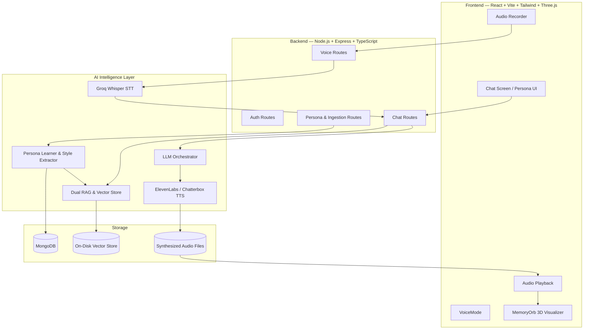
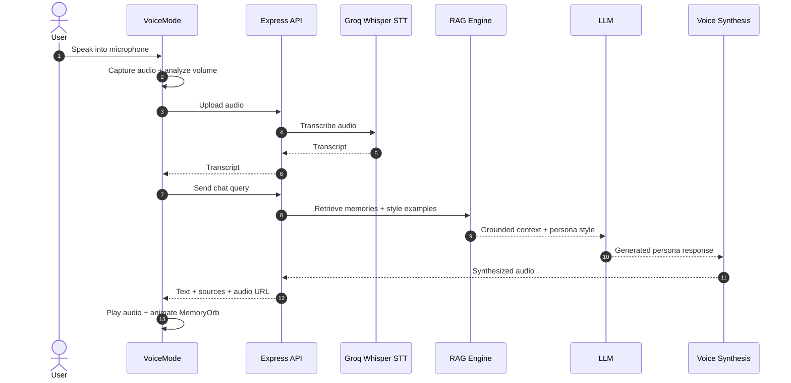

# ECHO — Interactive AI Persona & Voice Remembrance Platform

> **ECHO** is a full-stack AI memory companion that learns from uploaded conversations and voice references to create a grounded, personalized conversational experience.

ECHO combines **Dual RAG Memory Grounding**, **Persona Style Learning**, **Groq Whisper Speech-to-Text**, **multi-model LLM orchestration**, and **ElevenLabs / Chatterbox voice synthesis** into one text and hands-free voice experience.

---

## ✨ Why ECHO?

Traditional chatbots can generate convincing responses, but they often lack the **specific memories, communication style, and voice characteristics** that make a person feel recognizable.

ECHO addresses this by learning two complementary layers:

- 🧠 **Memory** — factual memories, stories, preferences, habits, relationships, and milestones.
- 💬 **Style** — vocabulary, tone, brevity, language patterns, signature phrases, punctuation, and emoji usage.

Every response is grounded in the selected persona's retrieved memories and style examples, while unknown facts are handled with a grounded fallback instead of being invented.

---

## 🚀 Key Features

### 🧠 Dual RAG Memory System
- Persona-scoped semantic memory retrieval.
- Separate retrieval of factual memories and historical dialogue/style examples.
- Strict `personaId` filtering prevents cross-persona memory leakage.
- Grounding metadata and source provenance are returned with responses.
- Unknown information can trigger a graceful **"I don't know"** style fallback.

### 🎭 Persona Style Learning
Learns communication patterns from uploaded conversations, including:

- Tone and vocabulary
- English, Hindi and Hinglish patterns
- Response length and brevity
- Signature phrases
- Punctuation habits
- Emoji frequency
- Conversational examples used as dynamic few-shot context

### 🎙️ Voice Conversations
Complete voice pipeline:

**Voice Input → Whisper STT → RAG → LLM → TTS → Audio Playback**

- Browser microphone recording.
- Automatic silence detection.
- Groq Whisper transcription.
- AI response generation.
- ElevenLabs voice synthesis.
- Optional local Chatterbox voice engine.
- Continuous hands-free conversation.

### 🌌 3D MemoryOrb
A Three.js visualizer reacts to the current conversation state:

- **Idle:** subtle breathing glow
- **Listening:** microphone-responsive aura
- **Thinking:** retrieval/generation animation
- **Speaking:** audio-synchronized pulse

### 👤 Multiple Personas
Create and manage multiple independent AI personas. Each persona has its own:

- Memories
- Style profile
- Voice profile
- Conversation history
- Vector data

### 🔐 Authentication & Isolation
- JWT-based authentication.
- Bcrypt password hashing.
- Protected API routes.
- Persona ownership checks.
- Unauthorized-access protection.
- Multi-persona isolation testing.

---

## 🏗️ System Architecture



---

## 🔄 How ECHO Works

### 1. Voice Chat Pipeline



### 2. Persona Learning & Ingestion

When a WhatsApp export or other supported conversation file is uploaded:

1. **Chat ingestion** parses timestamps, participants, conversational turns and system messages.
2. **Memory extraction** identifies factual anchors such as names, places, trips, milestones, habits and relationships.
3. **Style learning** analyzes tone, vocabulary, language patterns, response length, signature phrases and emoji usage.
4. **Vector indexing** embeds memories and historical response examples into a persona-scoped vector space.

### 3. Dual RAG Retrieval

For every incoming query:

**Phase 1 — Fact Retrieval**

Searches the persona's memory embeddings and retrieves relevant factual context when similarity exceeds the configured threshold.

**Phase 2 — Style Retrieval**

Searches historical dialogue pairs and retrieves the top **3–5** stylistically relevant responses as dynamic few-shot examples.

**Phase 3 — Generation**

Combines:

- Persona identity
- Linguistic rules
- Retrieved memories
- Retrieved style examples

The resulting prompt is sent to the configured LLM provider.

**Phase 4 — Grounded Fallback**

When factual information is outside the known memory set, ECHO avoids inventing an answer and responds with a lack-of-knowledge fallback.

---

## 🧰 Technology Stack

| Layer | Technology |
|---|---|
| Frontend | React, Vite, Tailwind CSS, Three.js |
| Backend | Node.js, Express, TypeScript |
| Database | MongoDB / Mongoose |
| Authentication | JWT + Bcrypt |
| RAG | Semantic embeddings + on-disk vector store |
| LLM | Groq, OpenAI-compatible provider |
| STT | Groq Whisper `whisper-large-v3` |
| TTS | ElevenLabs + local Chatterbox |
| Local Voice Engine | Python + FastAPI |
| Audio | WebM / WAV / MP4 / OGG / AAC |
| Testing | Vitest |
| Deployment | Vercel + Render / Railway / AWS |

---

## 📁 Repository Structure

```text
echo-frontend/
├── backend/
│   ├── src/
│   │   ├── config/
│   │   │   ├── database.ts
│   │   │   └── env.ts
│   │   ├── middleware/
│   │   │   └── auth.middleware.ts
│   │   ├── models/
│   │   │   ├── User.ts
│   │   │   ├── Persona.ts
│   │   │   ├── Memory.ts
│   │   │   ├── VoiceProfile.ts
│   │   │   ├── ConversationMessage.ts
│   │   │   ├── ChatSession.ts
│   │   │   └── StyleProfile.ts
│   │   ├── routes/
│   │   │   ├── auth.routes.ts
│   │   │   ├── persona.routes.ts
│   │   │   ├── chat.routes.ts
│   │   │   ├── voice.routes.ts
│   │   │   └── analysis.routes.ts
│   │   ├── services/
│   │   │   ├── llm/
│   │   │   │   ├── index.ts
│   │   │   │   ├── GroqLLMProvider.ts
│   │   │   │   └── OpenAILLMProvider.ts
│   │   │   ├── rag/
│   │   │   │   ├── ragService.ts
│   │   │   │   └── vectorStore.ts
│   │   │   ├── voice/
│   │   │   │   ├── ElevenLabsVoiceService.ts
│   │   │   │   ├── ChatterboxVoiceService.ts
│   │   │   │   └── voiceFactory.ts
│   │   │   ├── dataIngestion/
│   │   │   ├── personaLearner.ts
│   │   │   └── voiceClientService.ts
│   │   ├── app.ts
│   │   └── index.ts
│   ├── tests/
│   ├── package.json
│   └── tsconfig.json
│
├── echo-frontend/
│   ├── src/
│   │   ├── components/
│   │   │   ├── shared/
│   │   │   ├── LandingScreen.jsx
│   │   │   ├── PersonaList.jsx
│   │   │   ├── CreatePersonaModal.jsx
│   │   │   ├── VoiceUploadModal.jsx
│   │   │   ├── ChatScreen.jsx
│   │   │   ├── VoiceMode.jsx
│   │   │   ├── MemoryOrb.jsx
│   │   │   └── MemoryDrawer.jsx
│   │   ├── services/
│   │   │   ├── api.js
│   │   │   └── wavRecorder.js
│   │   ├── index.css
│   │   ├── App.jsx
│   │   └── main.jsx
│   ├── package.json
│   └── vite.config.js
│
└── voice-engine/
    ├── engine/
    │   ├── chatterbox_voice.py
    │   └── whisper_service.py
    ├── main.py
    └── requirements.txt
```

---

## 🧠 Backend Architecture

### LLM Service

Located in `backend/src/services/llm/`.

- Primary models: Groq `llama-3.3-70b-versatile` / `openai/gpt-oss-120b`
- Fallback models: `openai/gpt-oss-20b`, `qwen/qwen3.8-27b`, OpenAI API
- Temperature modulation for response variety.
- Anti-looping directives for repetitive responses.
- Dynamic tone, vocabulary, Hinglish, punctuation, emoji and sign-off preservation.

### RAG & Vector Memory

Located in `backend/src/services/rag/`.

- High-dimensional normalized semantic embeddings.
- Disk-backed vector store at `data/vector_store.json`.
- In-memory cosine similarity indexing.
- Persona-scoped vector filtering using `personaId`.

### Speech-to-Text

Located in `backend/src/services/voiceClientService.ts`.

- Groq Whisper `whisper-large-v3`.
- Supports WebM, WAV, MP4, OGG and AAC.
- Temporary audio files are cleaned after processing.

### Voice Synthesis

Located in `backend/src/services/voice/`.

- ElevenLabs voice cloning and multilingual synthesis.
- Local Chatterbox V3 fallback.
- Generated WAV files are exposed through `/api/audio/:filename`.

---

## 🎨 Frontend & Voice Experience

### MemoryOrb

The Three.js visualizer communicates the current state of the AI conversation:

| State | Visual behavior |
|---|---|
| Idle | Subtle breathing glow |
| Listening | Microphone-responsive cyan aura |
| Thinking | Purple / indigo retrieval animation |
| Speaking | Ember pulse synchronized with audio |

### VoiceMode

`VoiceMode.jsx` and `wavRecorder.js` provide:

- Dynamic `MediaRecorder` MIME detection.
- WebM/Opus, WebM, MP4, OGG and WAV support.
- Live `AudioContext` analysis.
- Automatic turn detection after approximately **1.4 seconds of silence**.
- Single playback instance to prevent overlapping audio.
- Mobile autoplay handling.
- Automatic return to listening after playback.

---

## 🐍 Optional Local Voice Engine

The `voice-engine/` directory provides an optional Python service for local voice capabilities.

**Framework:** FastAPI  
**Default port:** `8000`

### Endpoints

| Method | Endpoint | Purpose |
|---|---|---|
| POST | `/transcribe` | Transcribe WAV/WebM audio |
| POST | `/synthesize` | Local Chatterbox speech synthesis |
| POST | `/clone` | Create local speaker embeddings from reference audio |

---

## 🗄️ Data Models

ECHO uses the following primary MongoDB/Mongoose models:

### User
Stores account identity and bcrypt-hashed credentials.

### Persona
Stores the persona identity, relationship, target participant, style profile and analysis state.

### Memory
Stores persona-specific facts/stories/preferences/habits, importance and embeddings.

### VoiceProfile
Stores the persona voice reference, provider voice ID and synthesis settings.

### ConversationMessage
Stores text/voice messages, session information, grounding status, sources and generated audio URLs.

### StyleProfile
Stores the learned linguistic characteristics used to preserve the persona's communication style.

---

## 📡 API Overview

> The following is a concise overview of the implemented REST API. Authentication uses Bearer JWT where indicated.

### Authentication — `/api/auth`

| Method | Endpoint | Purpose | Auth |
|---|---|---|---|
| POST | `/register` | Create account | — |
| POST | `/login` | Login and receive JWT | — |
| GET | `/profile` | Get authenticated user | JWT |

### Personas — `/api/personas`

| Method | Endpoint | Purpose | Auth |
|---|---|---|---|
| GET | `/` | List owned personas | JWT |
| POST | `/` | Create persona | JWT |
| GET | `/:id` | Get persona + memory stats | JWT |
| PATCH | `/:id` | Update persona | JWT |
| DELETE | `/:id` | Delete persona and related data | JWT |
| POST | `/:id/upload` | Upload chat history | JWT |
| POST | `/:id/analyze` | Extract memories + learn style | JWT |
| GET | `/:id/memories` | List extracted memories | JWT |

### Chat — `/api/chat`

| Method | Endpoint | Purpose | Auth |
|---|---|---|---|
| POST | `/:personaId` | Send text/voice turn | JWT |
| GET | `/:personaId/history` | Retrieve conversation history | JWT |

### Voice & Audio

| Method | Endpoint | Purpose | Auth |
|---|---|---|---|
| POST | `/api/personas/:id/voice/transcribe` | Speech-to-text | JWT |
| POST | `/api/personas/:id/voice/upload` | Upload voice reference | JWT |
| POST | `/api/personas/:id/voice/synthesize` | Direct TTS synthesis | JWT |
| GET | `/api/audio/:filename` | Stream generated WAV | Public |

---

## 🔐 Environment Variables

### Backend — `backend/.env`

```env
PORT=4000
NODE_ENV=development
CORS_ORIGIN=http://localhost:5173

MONGODB_URI=mongodb://127.0.0.1:27017/echo

JWT_SECRET=your_super_secret_jwt_key_here

GROQ_API_KEY=gsk_your_groq_api_key_here
OPENAI_API_KEY=your_openai_api_key_optional
OPENAI_BASE_URL=https://api.openai.com/v1

ELEVENLABS_API_KEY=your_elevenlabs_api_key_here

VOICE_SERVICE_URL=http://localhost:8000
```

### Frontend — `echo-frontend/.env`

```env
VITE_API_URL=http://localhost:4000/api
```

> **Security:** Never commit real API keys, JWT secrets, credentials or private voice references to GitHub. Use environment variables and secret management in production.

---

## 💻 Local Development

### Prerequisites

- Node.js **18+**
- MongoDB running locally or MongoDB Atlas
- npm or yarn
- Python 3.x if using the optional local voice engine

### 1. Backend

```bash
cd backend
npm install
npm run build
npm run dev
```

Backend:

```text
http://localhost:4000
```

### 2. Frontend

```bash
cd echo-frontend
npm install
npm run dev
```

Frontend:

```text
http://localhost:5173
```

### 3. Optional Python Voice Engine

```bash
cd voice-engine

python -m venv venv

# Windows
.\venv\Scripts\activate

# Linux/macOS
source venv/bin/activate

pip install -r requirements.txt
python main.py
```

Voice service:

```text
http://localhost:8000
```

---

## 🧪 Testing

The backend includes an automated **16-suite Vitest test suite** covering the platform's core functionality.

Run:

```bash
cd backend
npm test
```

### Coverage Highlights

- Voice turn-taking and end-to-end voice continuity.
- STT audio upload and transcription.
- Continuous RAG chat.
- Audio synthesis and text/voice history continuity.
- Groq LLM + ElevenLabs integration.
- Multi-persona isolation.
- Hinglish tone adaptation.
- Memory grounding.
- Out-of-domain fallback behavior.
- Cascade deletion and unauthorized-access prevention.
- API-key leak checks.

---

## 🌐 Production Deployment

### Frontend — Vercel

1. Set root directory to `echo-frontend`.
2. Build command:

```bash
npm run build
```

3. Output directory:

```text
dist
```

4. Set:

```env
VITE_API_URL=https://your-backend-domain.onrender.com/api
```

### Backend — Render / Railway / AWS

1. Set root directory to `backend`.
2. Build command:

```bash
npm run build
```

3. Start command:

```bash
node dist/index.js
```

4. Configure:

```text
MONGODB_URI
JWT_SECRET
GROQ_API_KEY
ELEVENLABS_API_KEY
CORS_ORIGIN
```

5. Ensure `CORS_ORIGIN` matches the deployed frontend URL.

---

## ⚡ Performance & Reliability

The architecture is designed around low-latency conversational interaction:

- Fast Groq LLM inference.
- Semantic retrieval over an in-memory indexed vector store.
- Persona-scoped retrieval to reduce irrelevant context.
- Audio streaming rather than requiring a full conversational page refresh.
- Single-instance playback to avoid overlapping speech.
- External voice synthesis with a local fallback option.
- Automated cleanup of temporary audio files.

> Actual latency depends on model selection, network conditions, audio length, API load and deployment environment. The values in the implementation should be treated as observed/target characteristics rather than universal guarantees.

---

## 🔒 Privacy & Safety Considerations

ECHO can process highly personal conversation and voice data. A responsible deployment should therefore:

- Obtain appropriate consent before using another person's conversations or voice.
- Keep uploaded conversations and voice references private.
- Protect API credentials and authentication secrets.
- Enforce persona ownership and access control.
- Avoid exposing raw conversation data unnecessarily.
- Clearly identify AI-generated responses and synthesized voices where appropriate.
- Provide deletion controls for persona memories, conversations and generated audio.

---

## 🎯 Project Highlights

**ECHO is more than a chatbot.**

It combines:

```text
Conversation Data
       ↓
   Ingestion
       ↓
Memory Extraction + Style Learning
       ↓
 Persona-scoped Vector Store
       ↓
Dual RAG Retrieval
       ↓
LLM Persona Generation
       ↓
Voice Synthesis
       ↓
Interactive Voice Experience
```

The result is a conversational system that aims to preserve **what a persona remembers, how they communicate, and how the interaction feels** — while keeping factual responses grounded in available source data.

---

## 🔮 Future Improvements

Potential next steps include:

- More embedding/vector database options.
- Better semantic chunking and retrieval evaluation.
- More local/offline speech and voice models.
- Streaming STT and TTS for lower perceived latency.
- More robust consent and privacy controls.
- Improved multilingual persona learning.
- Retrieval evaluation dashboards and P50/P90/P95/P99 latency analytics.
- Scalable cloud storage for large audio and conversation datasets.

---

## 📜 License

Add the project's chosen license here, for example `MIT`, before publishing the repository.

---

## 👨‍💻 Author

**Arun Kumar**

Built as an AI-powered exploration of **memory grounding, persona learning, RAG, conversational AI and voice interaction**.

---

<p align="center">
  <b>ECHO — Remember. Understand. Respond.</b>
</p>
