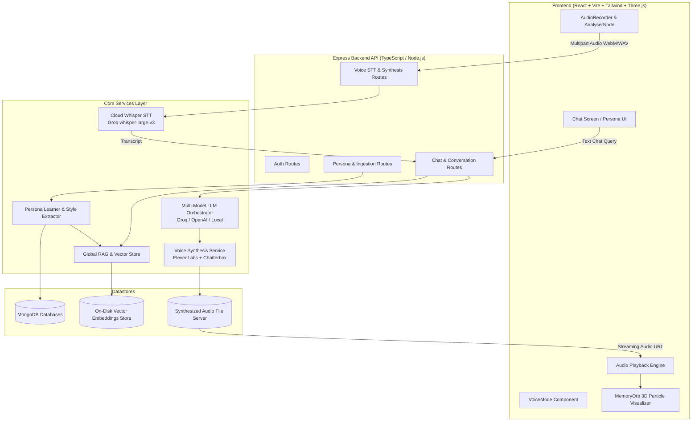
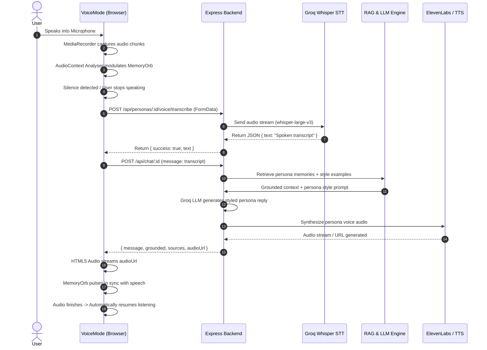

# ECHO — Interactive AI Persona & Voice Remembrance Platform

ECHO is a full-stack, production-grade conversational intelligence platform that reconstructs authentic AI personas from uploaded chat histories and voice references. It combines **Dual RAG Memory Grounding**, **Persona Style Learning**, **Groq Whisper Speech-to-Text**, **Multi-Model LLM Orchestration**, and **ElevenLabs / Chatterbox Voice Synthesis** into a seamless real-time text and hands-free voice experience.

---

## 📑 Table of Contents

1. [System Architecture](#-system-architecture)
2. [End-to-End Pipelines](#-end-to-end-pipelines)
   - [Voice Chat Pipeline (STT → RAG → LLM → TTS)](#1-voice-chat-pipeline)
   - [Persona Learning & Ingestion Pipeline](#2-persona-learning--ingestion-pipeline)
   - [Dual RAG Retrieval & Style Injection](#3-dual-rag-retrieval--style-injection)
3. [Repository Structure](#-repository-structure)
4. [Backend Architecture & Modules](#-backend-architecture--modules)
5. [Frontend Architecture & UI System](#-frontend-architecture--ui-system)
6. [Voice Engine (Python Service)](#-voice-engine-python-service)
7. [Database Models & Schemas](#-database-models--schemas)
8. [API Reference](#-api-reference)
9. [Environment Variables](#-environment-variables)
10. [Local Development Setup](#-local-development-setup)
11. [Testing & Verification](#-testing--verification)
12. [Production Deployment Guide](#-production-deployment-guide)

---

## 🏛 System Architecture



---

## 🔄 End-to-End Pipelines

### 1. Voice Chat Pipeline



### 2. Persona Learning & Ingestion Pipeline

When a chat export (WhatsApp, text transcripts, etc.) is uploaded:
1. **Chat Ingestion Parser** (`chatIngestionService.ts`): Parses multi-format timestamps, extracts participants, sanitizes system messages, and normalizes conversational turns.
2. **Discrete Memory Extraction** (`personaLearner.ts`): Extracts factual biographical anchors (names, places, trips, shared milestones, habits, relationships) using high-precision prompt extraction.
3. **Style Profile Generation** (`personaLearner.ts`): Analyzes tone, language patterns (English, Hindi, Hinglish), vocabulary, response brevity, signature phrases, and emoji frequency.
4. **Vector Embedding & Indexing** (`vectorStore.ts`, `ragService.ts`): Embeds both memories and few-shot response examples into the persona-scoped vector space.

### 3. Dual RAG Retrieval & Style Injection

For every incoming chat query:
- **Phase 1 (Fact Retrieval)**: Performs cosine similarity vector search over the persona's `Memory` embeddings. If similarity exceeds threshold $\tau$, factual context is injected with source provenance (`grounded: true`).
- **Phase 2 (Style Retrieval)**: Performs vector search over the persona's historical dialogue pairs (`StyleProfile`) to retrieve the top 3-5 most stylistically relevant past responses as dynamic few-shot examples.
- **Phase 3 (Generation)**: Constructs a system prompt combining persona identity, linguistic rules, retrieved memories, and style examples, passed to Groq (`llama-3.3-70b-versatile` / `openai/gpt-oss-120b`).
- **Phase 4 (Grounded Fallback)**: If a query asks for factual information outside known memories, the persona gracefully admits lack of knowledge without hallucinating.

---

## 📁 Repository Structure

```
echo-frontend/
├── backend/                       # Node.js + Express + TypeScript Backend
│   ├── src/
│   │   ├── config/                # Database & Environment configuration
│   │   │   ├── database.ts        # MongoDB Mongoose connection
│   │   │   └── env.ts             # Validated environment variables
│   │   ├── middleware/            # Auth & Multer upload middlewares
│   │   │   └── auth.middleware.ts # JWT authentication guard
│   │   ├── models/                # Mongoose schema models
│   │   │   ├── User.ts            # User accounts & credentials
│   │   │   ├── Persona.ts         # Personas (name, relation, style)
│   │   │   ├── Memory.ts          # Persona discrete memories
│   │   │   ├── VoiceProfile.ts    # Cloned voice reference mappings
│   │   │   ├── ConversationMessage.ts # Unified chat/voice message store
│   │   │   ├── ChatSession.ts     # Multi-turn session context
│   │   │   └── StyleProfile.ts    # Persona linguistic style parameters
│   │   ├── routes/                # REST API controllers
│   │   │   ├── auth.routes.ts     # Register, login, profile
│   │   │   ├── persona.routes.ts  # Persona CRUD, chat upload, analyze
│   │   │   ├── chat.routes.ts     # Unified text/voice chat & history
│   │   │   ├── voice.routes.ts    # Voice STT transcribe & voice synthesis
│   │   │   └── analysis.routes.ts # Ingestion analysis & metrics
│   │   ├── services/              # Core business intelligence logic
│   │   │   ├── llm/               # Multi-provider LLM abstraction
│   │   │   │   ├── index.ts       # Global LLM Service & fallback manager
│   │   │   │   ├── GroqLLMProvider.ts     # Groq Cloud API provider
│   │   │   │   └── OpenAILLMProvider.ts  # OpenAI-compatible provider
│   │   │   ├── rag/               # Retrieval-Augmented Generation
│   │   │   │   ├── ragService.ts  # Dual RAG indexing & memory retrieval
│   │   │   │   └── vectorStore.ts # On-disk vector database & embeddings
│   │   │   ├── voice/             # Text-to-Speech synthesis
│   │   │   │   ├── ElevenLabsVoiceService.ts # ElevenLabs voice cloning/TTS
│   │   │   │   ├── ChatterboxVoiceService.ts # Local Chatterbox V3 fallback
│   │   │   │   └── voiceFactory.ts           # Synthesis provider switch
│   │   │   ├── dataIngestion/     # WhatsApp / chat export parser
│   │   │   ├── personaLearner.ts  # Style analysis & memory extraction
│   │   │   └── voiceClientService.ts # Groq Whisper cloud STT engine
│   │   ├── app.ts                 # Express app middleware & route mounting
│   │   └── index.ts               # Server startup & port binding
│   ├── tests/                     # Vitest automated test suite (16 test files)
│   ├── package.json
│   └── tsconfig.json
│
├── echo-frontend/                 # React + Vite Frontend
│   ├── src/
│   │   ├── components/            # UI components
│   │   │   ├── shared/            # Reusable basic elements & Logo
│   │   │   ├── LandingScreen.jsx  # Hero landing page & auth tabs
│   │   │   ├── PersonaList.jsx    # Persona dashboard & selector
│   │   │   ├── CreatePersonaModal.jsx # Wizard for creating personas
│   │   │   ├── VoiceUploadModal.jsx   # Voice reference sample upload
│   │   │   ├── ChatScreen.jsx     # Main chat UI with text input & audio play
│   │   │   ├── VoiceMode.jsx      # Full-screen hands-free voice experience
│   │   │   ├── MemoryOrb.jsx      # Three.js 3D dynamic particle visualizer
│   │   │   └── MemoryDrawer.jsx   # Live view of persona extracted memories
│   │   ├── services/
│   │   │   ├── api.js             # Centralized Axios client & API endpoints
│   │   │   └── wavRecorder.js     # MediaRecorder & audio chunk processor
│   │   ├── index.css              # Custom styling, dark mode & animations
│   │   ├── App.jsx                # Application root state & routing
│   │   └── main.jsx               # React DOM entrypoint
│   ├── package.json
│   └── vite.config.js
│
└── voice-engine/                  # Optional Local Python Voice Engine
    ├── engine/
    │   ├── chatterbox_voice.py    # Local speech synthesis engine
    │   └── whisper_service.py     # Local SpeechRecognition / Whisper service
    ├── main.py                    # FastAPI server exposing /transcribe & /clone
    └── requirements.txt
```

---

## ⚙️ Backend Architecture & Modules

### 1. LLM Service (`src/services/llm/`)
- **Primary Model**: Groq `llama-3.3-70b-versatile` / `openai/gpt-oss-120b` (low latency: ~300ms).
- **Secondary Fallbacks**: `openai/gpt-oss-20b`, `qwen/qwen3.8-27b`, OpenAI API.
- **Anti-Repetition & Variety**: Automatic temperature modulation and anti-looping directives if repetitive phrases are detected.
- **Tone Preservation**: Injects vocabulary, Hinglish nuances, punctuation, emoji patterns, and sign-offs dynamically into system prompts.

### 2. RAG & Vector Memory Service (`src/services/rag/`)
- **Embeddings**: High-dimensional normalized semantic embeddings.
- **Vector Database**: Disk-backed vector store (`data/vector_store.json`) with sub-millisecond in-memory cosine similarity indexing.
- **Strict Isolation**: All vectors are tagged with `personaId` and filtered strictly per persona, eliminating cross-persona contamination.

### 3. Speech-to-Text (STT) Service (`src/services/voiceClientService.ts`)
- **Cloud STT**: Direct integration with Groq Whisper API (`whisper-large-v3`) providing fast transcription in ~1.2s.
- **Format Support**: Handles WebM, WAV, MP4, OGG, and AAC multipart audio streams.
- **Resource Management**: Automatically cleans up temporary files after processing (`fs.unlinkSync`).

### 4. Voice Synthesis Service (`src/services/voice/`)
- **Primary Engine**: ElevenLabs Voice Cloning & Multilingual Synthesis.
- **Local Fallback**: Built-in Chatterbox V3 PCM WAV synthesis engine ensuring audio playback never fails even when external API quotas are exhausted.
- **Public Audio Server**: Serves generated WAV files over static HTTP route (`/api/audio/:filename`).

---

## 🎨 Frontend Architecture & UI System

### 1. Visual Aesthetics & Design System
- **Dark Elegance**: Warm amber (`#e7a857`), midnight charcoal (`#0f0c08`), and glowing cyan (`#7fd4e0`) palette.
- **3D Particle MemoryOrb**: Powered by Three.js with shader-based particle rotation that responds dynamically to audio amplitude:
  - *Listening State*: Gentle cyan aura responding to user microphone volume.
  - *Thinking State*: Shifting purple/indigo swirl during RAG retrieval and LLM generation.
  - *Speaking State*: Vibrant ember pulse synchronized with audio playback.
  - *Idle State*: Subtle breathing glow.

### 2. Audio Capture & Turn-Taking (`VoiceMode.jsx` & `wavRecorder.js`)
- **Dynamic MIME Detection**: Automatically queries `MediaRecorder.isTypeSupported()` for `audio/webm;codecs=opus`, `audio/webm`, `audio/mp4`, `audio/ogg`, or `audio/wav`.
- **AudioContext Analyser**: Tracks live volume frequency bins for visual feedback and automatic silence detection (triggers user turn after 1.4s of silence).
- **Single Playback Instance**: Prevents overlapping audio, handles mobile autoplay restrictions, and seamlessly triggers the next listening cycle upon audio end.

---

## 🐍 Voice Engine (Python Service)

The optional Python engine in `voice-engine/` provides offline local capabilities:
- **FastAPI Framework**: Runs on port `8000`.
- **Endpoints**:
  - `POST /transcribe`: Transcribes WAV/WebM audio via Whisper / SpeechRecognition.
  - `POST /synthesize`: Synthesizes speech using local Chatterbox TTS.
  - `POST /clone`: Creates local speaker embeddings from reference audio.

---

## 🗄 Database Models & Schemas

### 1. User (`User.ts`)
```typescript
{
  email: { type: String, required: true, unique: true },
  password: { type: String, required: true }, // bcrypt hashed
  name: { type: String },
  createdAt: { type: Date, default: Date.now }
}
```

### 2. Persona (`Persona.ts`)
```typescript
{
  userId: { type ObjectId, ref: 'User', required: true },
  name: { type: String, required: true },
  relationship: { type: String, required: true }, // 'Father', 'Friend', etc.
  targetParticipant: { type: String },
  styleProfile: { type: Object }, // Extracted vocabulary, tone, length, emojis
  isAnalyzed: { type: Boolean, default: false },
  createdAt: { type: Date, default: Date.now }
}
```

### 3. Memory (`Memory.ts`)
```typescript
{
  personaId: { type ObjectId, ref: 'Persona', required: true },
  content: { type: String, required: true },
  category: { type: String, enum: ['fact', 'story', 'preference', 'habit'] },
  importance: { type: Number, min: 1, max: 10 },
  embedding: [Number],
  createdAt: { type: Date, default: Date.now }
}
```

### 4. VoiceProfile (`VoiceProfile.ts`)
```typescript
{
  personaId: { type ObjectId, ref: 'Persona', required: true, unique: true },
  voiceId: { type: String, required: true }, // ElevenLabs Voice ID or Chatterbox ID
  sampleUrl: { type: String },
  settings: {
    stability: { type: Number, default: 0.75 },
    similarityBoost: { type: Number, default: 0.75 }
  },
  createdAt: { type: Date, default: Date.now }
}
```

### 5. ConversationMessage (`ConversationMessage.ts`)
```typescript
{
  personaId: { type ObjectId, ref: 'Persona', required: true },
  sessionId: { type: String, required: true },
  role: { type: String, enum: ['user', 'echo'], required: true },
  text: { type: String, required: true },
  grounded: { type: Boolean, default: false },
  sources: [String],
  audioUrl: { type: String },
  createdAt: { type: Date, default: Date.now }
}
```

---

## 📡 API Reference

### Authentication Routes (`/api/auth`)
| Method | Endpoint | Description | Auth Required |
| :--- | :--- | :--- | :--- |
| `POST` | `/api/auth/register` | Create a new user account | No |
| `POST` | `/api/auth/login` | Log in and receive JWT token | No |
| `GET` | `/api/auth/profile` | Get current authenticated user details | Bearer JWT |

### Persona Management (`/api/personas`)
| Method | Endpoint | Description | Auth Required |
| :--- | :--- | :--- | :--- |
| `GET` | `/api/personas` | List all personas owned by user | Bearer JWT |
| `POST` | `/api/personas` | Create a new persona | Bearer JWT |
| `GET` | `/api/personas/:id` | Get persona profile & memory stats | Bearer JWT |
| `PATCH` | `/api/personas/:id` | Update persona details or target participant | Bearer JWT |
| `DELETE`| `/api/personas/:id` | Cascade delete persona and all memories/audio | Bearer JWT |
| `POST` | `/api/personas/:id/upload` | Upload chat history file/text for ingestion | Bearer JWT |
| `POST` | `/api/personas/:id/analyze`| Trigger memory extraction & style learning | Bearer JWT |
| `GET` | `/api/personas/:id/memories`| List all extracted discrete memories | Bearer JWT |

### Chat & Conversation (`/api/chat`)
| Method | Endpoint | Description | Auth Required |
| :--- | :--- | :--- | :--- |
| `POST` | `/api/chat/:personaId` | Send text/voice turn; returns styled reply & audio | Bearer JWT |
| `GET` | `/api/chat/:personaId/history`| Fetch full conversation history across text and voice | Bearer JWT |

### Voice & Audio (`/api/personas/:id/voice` & `/api/audio`)
| Method | Endpoint | Description | Auth Required |
| :--- | :--- | :--- | :--- |
| `POST` | `/api/personas/:id/voice/transcribe` | Transcribe recorded audio file to text (STT) | Bearer JWT |
| `POST` | `/api/personas/:id/voice/upload` | Upload voice reference WAV for voice cloning | Bearer JWT |
| `POST` | `/api/personas/:id/voice/synthesize` | Direct text-to-speech synthesis for persona | Bearer JWT |
| `GET` | `/api/audio/:filename` | Stream synthesized audio WAV file | Public |

---

## 🔐 Environment Variables

### Backend Configuration (`backend/.env`)
```env
# Server
PORT=4000
NODE_ENV=development
CORS_ORIGIN=http://localhost:5173

# Database
MONGODB_URI=mongodb://127.0.0.1:27017/echo

# Security
JWT_SECRET=your_super_secret_jwt_key_here

# LLM Providers
GROQ_API_KEY=gsk_your_groq_api_key_here
OPENAI_API_KEY=your_openai_api_key_optional
OPENAI_BASE_URL=https://api.openai.com/v1

# Voice Synthesis
ELEVENLABS_API_KEY=your_elevenlabs_api_key_here

# Python Voice Engine (Optional)
VOICE_SERVICE_URL=http://localhost:8000
```

### Frontend Configuration (`echo-frontend/.env`)
```env
VITE_API_URL=http://localhost:4000/api
```

---

## 🚀 Local Development Setup

### Prerequisites
- **Node.js**: v18.0.0 or higher
- **MongoDB**: Running locally on `mongodb://127.0.0.1:27017` or a MongoDB Atlas URI
- **npm** or **yarn**

### 1. Clone & Setup Backend
```bash
cd backend
npm install
npm run build
npm run dev
# Backend starts on http://localhost:4000
```

### 2. Setup Frontend
```bash
cd echo-frontend
npm install
npm run dev
# Frontend starts on http://localhost:5173
```

### 3. (Optional) Setup Python Voice Engine
```bash
cd voice-engine
python -m venv venv
# Windows:
.\venv\Scripts\activate
# Linux/macOS:
source venv/bin/activate

pip install -r requirements.txt
python main.py
# Voice engine starts on http://localhost:8000
```

---

## 🧪 Testing & Verification

The project includes an extensive 16-suite automated test suite covering all layers of the platform:

```bash
cd backend
npm test
```

### Test Coverage Highlights
- `tests/voice_mode_e2e_continuity.test.ts`: Voice turn taking, STT audio upload, continuous RAG chat, audio synthesis, and text-voice history continuity.
- `tests/groq_elevenlabs_integration.test.ts`: 16-point verification of Groq LLM streaming and ElevenLabs voice cloning.
- `tests/dad_rahul_priya_isolation.test.ts`: Multi-persona isolation ensuring zero memory or style leakage across personas.
- `tests/conversational_intelligence.test.ts`: Hinglish tone adoption, memory grounding, and out-of-domain fallback testing.
- `tests/security.test.ts`: Cascade deletion, unauthorized access prevention, and API key leak checks.

---

## 🌐 Production Deployment Guide

### Frontend Deployment (Vercel)
1. Set the root directory to `echo-frontend`.
2. Build command: `npm run build`.
3. Output directory: `dist`.
4. Environment variable: `VITE_API_URL=https://your-backend-domain.onrender.com/api`.

### Backend Deployment (Render / Railway / AWS)
1. Set the root directory to `backend`.
2. Build command: `npm run build`.
3. Start command: `node dist/index.js`.
4. Add all environment variables (`MONGODB_URI`, `JWT_SECRET`, `GROQ_API_KEY`, `ELEVENLABS_API_KEY`, `CORS_ORIGIN`).
5. Ensure `CORS_ORIGIN` matches your production frontend Vercel URL.
